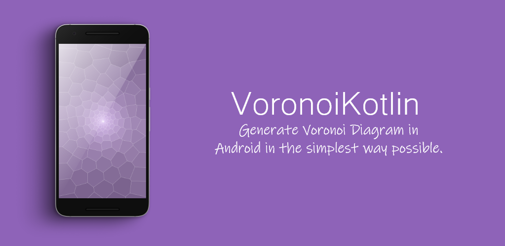

# VoronoiKotlin
Simple library for generate [Voronoi diagram](https://en.wikipedia.org/wiki/Voronoi_diagram#:~:text=In%20mathematics%2C%20a%20Voronoi%20diagram,%2C%20sites%2C%20or%20generators) written in Kotlin

<p align="center">
    
</p>
 
## About
VoronoiKotlin is an incredibly fast Kotlin library for generating Voronoi diagram of 2D points. The Voronoi diagram is constructed by connecting the circumcenters of adjacent triangles in the Delaunay triangulation and by using the library  [DelaunatorKotlin](https://github.com/slaviboy/DelaunatorKotlin). If you want to learn more about how to use the VoronoiKotlin library you can check the [Wiki](https://github.com/slaviboy/VoronoiKotlin/wiki) page.

[](http://developer.android.com/index.html)
[](https://android-arsenal.com/api?level=21)
[](https://github.com/slaviboy/VoronoiKotlin/releases/tag/v0.2.0)

## Add to your project
Add the jitpack maven repository
```
allprojects {
  repositories {
    ...
    maven { url 'https://jitpack.io' }
  }
}
``` 
Add the dependency
```
dependencies {
  implementation 'com.github.slaviboy:VoronoiKotlin:v0.2.0'
}
```
 
### How to use
Create Voronoi object by passing your Delaunay object that is initialized by you points coordinates in a form of DoubleArray that holds the x,y coordinate pair for each point. 
```kotlin

// make sure you add at least 3 pairs of x,y coordinates
val coordinates: DoubleArray = doubleArrayOf(
    19.0, 93.0,   // first point 
    1.0, 64.0,    // second point 
    23.0, 93.0,   // third point
    192.0, 43.0,  // fourth point
    14.0, 2.0     // fifth point
)

// create bound for the voronoi diagram
val bound: Voronoi.RectD = Voronoi.RectD(0.0, 0.0, 1080.0, 1920.0)

// create delaunay and voronoi objects
val delaunay = Delaunay(*coordinates)
val voronoi = Voronoi(delaunay, bound)

// get coordinates of all lines from the voronoi diagram
val linesCoordinates = voronoi.getLinesCoordinates()
```
 
If you want to draw the voronoi diagram in a View, you can check the available example on creating custom view [HERE](https://github.com/slaviboy/VoronoiKotlin/tree/master/app/src/main/java/com/slaviboy/voronoikotlinexamples/drawing).
 
